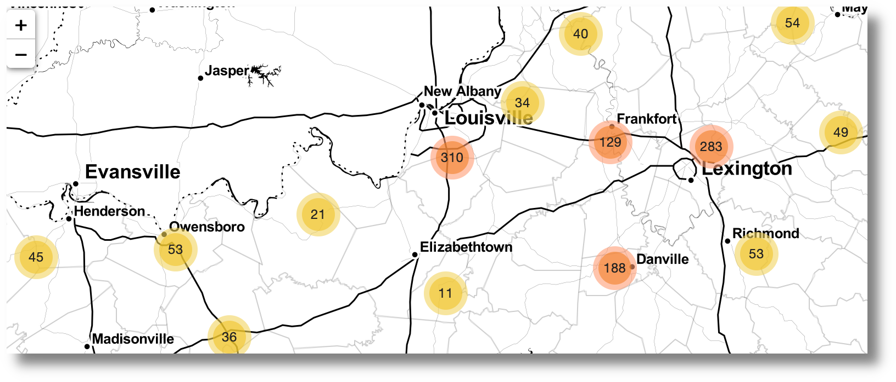

#Kentucky's Historical Markers
<div>
<br/>
<p align="center">
  <a href="https://www.robwiederstein.org/blog/2020/3/22/kentucky-historical-markers-or-why-kentucky-needs-an-open-data-portal">
    
  </a>
See <a href="https://www.robwiederstein.org/blog/2020/3/22/kentucky-historical-markers-or-why-kentucky-needs-an-open-data-portal">article</a>.
</p>
</div>

## About the Project

Kentucky maintains a historical marker [database]("https://secure.kentucky.gov/kyhs/hmdb/CountyMap.aspx)(KHMD).  This project is in two discrete parts: the building of a dataframe for the map markers and the display of the markers on a leaflet map.

The KHMD fields are not assigned separate html containers so the effort transformed from web scraping (`rvest`) to a regex (`stringr`) exercise. Or, in other words, it was a jumbled mess. However, the information is both extensive and informative. The primary constraint for the mapping of Kentucky’s historic markers was the lack of coordinates.

Scraping the database yielded 2226 total markers.  The markers are numbered between 1 and 2,610.  There are 412 that are not included in the database for whatever reason, including poor execution on my part. The database did have the county where the markers are located so the center of each county was computed and the markers were assigned there.  

For most counties that worked pretty well.  For example, the center of Jefferson County is Louisville and locating the markers there worked well.  However, they were stacked on top of each other. Jefferson County has 228 markers.

With 228 markers assigned the same coordinates, the "pop-up" contents were not easily viewed.  A minimal amout of random noise was introduced ("jitter") so the pop-up contents could be displayed.  This ended up with markers placed on the top of strip malls and car dealerships.  The map tiles were changed to Stamen so that building outlines were excluded.

### Built With

* [JQuery](https://jquery.com)
* [Leaflet](https://leafletjs.com)
* [R](https://cran.r-project.org)
* [https://www.convertcsv.com](https://www.convertcsv.com)
* [Stamen](http://maps.stamen.com/#terrain/12/37.7706/-122.3782)
* [rvest](http://rvest.tidyverse.org)
* [Leaflet Marker Cluster](https://github.com/Leaflet/Leaflet.markercluster)

### Prerequisites

The header code must reference `jquery`, `leaflet` and `leaflet market-cluster`. Leaflet, mentioned above, has excellent documentation. Crucial for the markers to cluster on the Stamen map are the following lines of code added to the header of the webpage:
```
<!--stylesheets load first-->
<link rel="stylesheet" type="text/css" href="https://cdnjs.cloudflare.com/ajax/libs/leaflet/1.6.0/leaflet.css" />
<link rel="stylesheet" type="text/css" href="https://cdnjs.cloudflare.com/ajax/libs/leaflet.markercluster/1.4.1/MarkerCluster.css" />
<link rel="stylesheet" type="text/css" href="https://cdnjs.cloudflare.com/ajax/libs/leaflet.markercluster/1.4.1/MarkerCluster.Default.css" />
<!--scripts load next-->
<script type='text/javascript' src='https://cdnjs.cloudflare.com/ajax/libs/jquery/3.4.1/jquery.min.js'></script>
<script type="text/javascript" src="https://cdnjs.cloudflare.com/ajax/libs/leaflet/1.6.0/leaflet.js"></script>
<script type='text/javascript' src='https://cdnjs.cloudflare.com/ajax/libs/leaflet.markercluster/1.4.1/leaflet.markercluster.js'></script>
<script type='text/javascript' src="https://cdnjs.cloudflare.com/ajax/libs/leaflet-providers/1.9.1/leaflet-providers.min.js"></script>

```
### Dependencies

Kentucky counties were added as a layer to the map from the Kentucky Open GIS [portal](http://kygovmaps-kygeonet.opendata.arcgis.com/datasets/5a94b295e38244a889ec1d875d6afcc5_0). An API for the full geojson feature collection is available [here](http://kygovmaps-kygeonet.opendata.arcgis.com/datasets/5a94b295e38244a889ec1d875d6afcc5_0.geojson).

## Installation

```

#install.packages("devtools")
devtools::install_github("RobWiederstein/my_functions")

#customize
git init
git clone https://github.com/RobWiederstein/my_functions.git
```


<!-- LICENSE -->
## License

Distributed under the MIT License. See [LICENSE](LICENSE.md) for more information.

## Contact

Rob Wiederstein [@RobWiederstein](https://twitter.com/RobWiederstein) - khuon68@gmail.com

Project Link: [https://github.com/RobWiederstein/covid-19-ky](https://github.com/RobWiederstein/covid-19-ky)


<!-- ACKNOWLEDGEMENTS -->
## Acknowledgements

* [Kentucky Historical Society](https://history.ky.gov)
* [Kentucky Open GIS](http://kygovmaps-kygeonet.opendata.arcgis.com)
